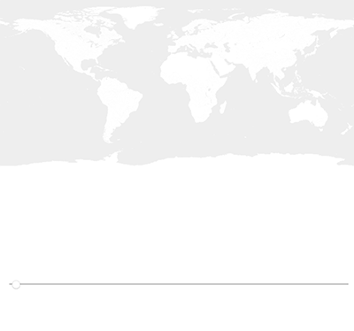

# Dataviz-p5js
<!-- TOC depthFrom:2 depthTo:6 withLinks:1 updateOnSave:1 orderedList:0 -->

- [Boucle for et Array](#boucle-for-et-array)
- [Charger des data depuis un fichier .csv](#charger-des-data-depuis-un-fichier-csv)
- [Charger des data depuis un fichier .json ou .geojson](#charger-des-data-depuis-un-fichier-json-ou-geojson)
- [Javascript et p5.js](#javascript-et-p5js)

<!-- /TOC -->
## Boucle for et Array

- **[01 - sketches/01-Sans-boucle](sketches/01-Sans-boucle)**
  - Pas de boucle (!).
  - Utilisation de la propriété `height` du canvas.

[version en ligne](https://editor.p5js.org/makio135/sketches/HkBOK_ZR7) avec [https://editor.p5js.org/](https://editor.p5js.org/)

---

- **[02a - sketches/02-Array-a](sketches/02-Array-a)**
  - Stockage des données dans un `Array` (tableau).
  - Boucle `for(let i = 0; i < n; i++){ }` pour parcourir le tableau.
    - Une source pour mieux comprendre le potentiel des boucles : [00 - Functions/boucle-for](sketches/00-Functions/boucle-for) — [version en ligne](https://editor.p5js.org/jbjoatton/sketches/Hkq5HByCm)
  - Fonction `map()` pour calculer la position x des `rect(x,y,largeur,hauteur)`.
    - La fonction `map()` en détail : [00 - Functions/map](sketches/00-Functions/map)
    - Une horloge avec `map()` : [00 - Functions/map-clock](sketches/00-Functions/map-clock) — [version en ligne](https://editor.p5js.org/jbjoatton/sketches/BJ3HWxfAm)
    - Répartition sur `x` des dates extraites d'un .csv : [00 - Functions/map-data](sketches/00-Functions/map-data) — [version en ligne](https://editor.p5js.org/jbjoatton/sketches/r1kYF8d67)
  - `push()` et `pop()` pour isoler les transformations `rotate(radians)` et `translate(x,y)` (sinon tout le canvas est transformé).

[version en ligne](https://editor.p5js.org/makio135/sketches/Sk2VoOWAX) avec [https://editor.p5js.org/](https://editor.p5js.org/)

---

- **[02b - sketches/02-Array-b](sketches/02-Array-b)**
  - Boucle `for` pour calculer le total et positionner les nouveaux rectangles du diagramme.

[version en ligne](https://editor.p5js.org/makio135/sketches/HyDoj_b0m) avec [https://editor.p5js.org/](https://editor.p5js.org/)

---

## Charger des data depuis un fichier .csv

- **[03a - sketches/03-loadCSV-a](sketches/03-loadCSV-a)**
  - Données stockées dans un fichier .csv externe (données séparées par des virgules)
  - Chargement des données dans une fonction globale `preload()` avec `loadTable()`
  - Propriétés et fonctions de l'objet table : `table.columns` (header des colonnes) ; `getRowCount()` (renvoie le nombre de lignes) ; `getColumn()` (stocke les valeurs d'une colonne dans un tableau).
  - Variable `t` qui augmente de 1 tant qu'elle est plus petite que 40. Condition `if(){ }`.
  - Fonction `text(variable, x, y)`;

[version en ligne](https://editor.p5js.org/makio135/sketches/r1cznO-A7) avec [https://editor.p5js.org/](https://editor.p5js.org/)

---

- **[03b - sketches/03-loadCSV-b](sketches/03-loadCSV-b)**
  - Fonction `translate(x,y)` pour décaler le canvas en fonction de la position de la souris `mouseX`.

[version en ligne](https://editor.p5js.org/jbjoatton/sketches/BJ1fN7Q6m) avec [https://editor.p5js.org/](https://editor.p5js.org/)

---

- **[03c - sketches/03-loadCSV-c](sketches/03-loadCSV-c)**
  - Tracé vectoriel de la ligne avec `beginShape()` et `endShape()`, et la fonction `curveVertex()`.
  - Modulo `%` pour savoir si un nombre est un multiple d'un autre nombre. Pour savoir si un nombre est un multiple de 50, on évalue le reste de la division du nombre par 50 : `if(h%50==0)`. Si il reste 0, ce nombre est bien un multiple de 50;

[version en ligne](https://editor.p5js.org/jbjoatton/sketches/ByF1TqNpm) avec [https://editor.p5js.org/](https://editor.p5js.org/)

---

## Charger des data depuis un fichier .json ou .geojson

- **[04a - sketches/04-loadJSON-a](sketches/04-loadJSON-a)**
  - Chargement d'un fichier de données JSON avec la fonction `loadJSON`.
  - Récupération des valeurs en parcourant l'objet JSON. Exemple pour la magnitude : `let earthquakeMag = earthquakes.features[i].properties.mag;`
  - Structure conditionnelle pour créer la grille : `if(posX < width-100){ posX += 50; }else{ posY += 50; posX = 50; }`.

[version en ligne](https://editor.p5js.org/jbjoatton/sketches/ry9OYqxpm) avec [https://editor.p5js.org/](https://editor.p5js.org/)

---

- **[04b - sketches/04-loadJSON-a](sketches/04-loadJSON-b)**
  - Chargement d'un fichier de données JSON avec la fonction `loadJSON`.
  - Fonction `img.resize()` pour redimensionner le fond de carte en fonction de la taille du canvas.
  - Création d'une fonction `convert(lat,lon)` pour convertir les coordonnées de latitude et longitude en position `x` et `y`

[version en ligne](https://editor.p5js.org/jbjoatton/sketches/SJT235lpQ) avec [https://editor.p5js.org/](https://editor.p5js.org/)

---

- **[04c - sketches/04-loadJSON-c](sketches/04-loadJSON-c)**
  - Création d'un slider avec `createSlider()` pour parcourir les données

[version en ligne](https://editor.p5js.org/jbjoatton/sketches/S1MTAGM6Q) avec [https://editor.p5js.org/](https://editor.p5js.org/)

---

- **[04d - sketches/04-loadJSON-WEBGL-d](sketches/04-loadJSON-WEBGL-d)**
  - Création d'un canvas WEBGL en ajoutant le paramètre `WEBGL` à la fin de la fonction de création du canvas.
  - Création de sphères avec la fonction `sphere(rayon)`.
  - Fonctions de transformation 3D : `rotateX`, `rotateY` et `rotateZ`.
  - Fonction `mouseWheel(event)` pour surveiller l'utilisation de la molette ou du scroll du pad. La valeur récupérée est affectée la variable permettant de contrôler le zoom (`posZ`).
  - Création d'une fonction `convert(lat,lon)` pour convertir les coordonnées GPS en coordonnées cartésiennes `x`, `y` et `z`.
  - Fonction `sin(nb)` pour faire "clignoter" les sphères. Très utile pour récupérer une valeur entre -1 et 1, et s'en servir de facteur.

[version en ligne](https://editor.p5js.org/jbjoatton/sketches/rJ2QKg1AX) avec [https://editor.p5js.org/](https://editor.p5js.org/)

---

## Javascript et p5.js

- **[05a - sketches/05-js-scroll](sketches/05-js-scroll)**
  - Récupération de la valeur scrollY avec `window.addEventListener`
  - Création du canvas dans un élément "parent" avec la fonction `canvas.parent()`
  - Positionnement fixe avec CSS `position:fixed`

[version en ligne](https://dev.jbjttn.fr/Dataviz-p5js/sketches/05-js-scroll/)
